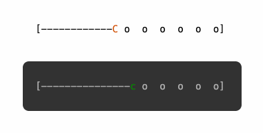

# monospace-loader

Monospace font-based, Pac-Man style progress bar built as a framework-agnostic Web Component.

Works in plain HTML, React, Vue, or any other framework.



## Install

```bash
npm install monospace-loader
```

## Usage

### Plain HTML

```html
<script type="module">
  import 'monospace-loader';
</script>

<monospace-loader progress="50"></monospace-loader>
```

### React

```tsx
import MonospaceLoader from 'monospace-loader';

<MonospaceLoader progress={progress} trackColor="#aaa" />
```

## Properties

| HTML attribute | React prop   | Type     | Default   | Description                         |
|----------------|--------------|----------|-----------|-------------------------------------|
| `progress`     | `progress`   | `number` | `0`       | Fill amount, 0–100                  |
| `cols`         | `cols`       | `number` | `32`      | Total character width               |
| `color`        | `color`      | `string` | `#d35400` | Color of the Pac-Man character      |
| `track-color`  | `trackColor` | `string` | inherited | Color of brackets, dashes, and dots |

All properties can also be set as JS properties:

```js
const el = document.querySelector('monospace-loader');
el.progress = 75;
el.color = 'steelblue';
```

## Showcase

The repo includes a React app that demonstrates all props and variants.

```bash
git clone https://github.com/jarekdanielak/monospace-loader
cd monospace-loader
npm install
npm run dev
```

## License

MIT
